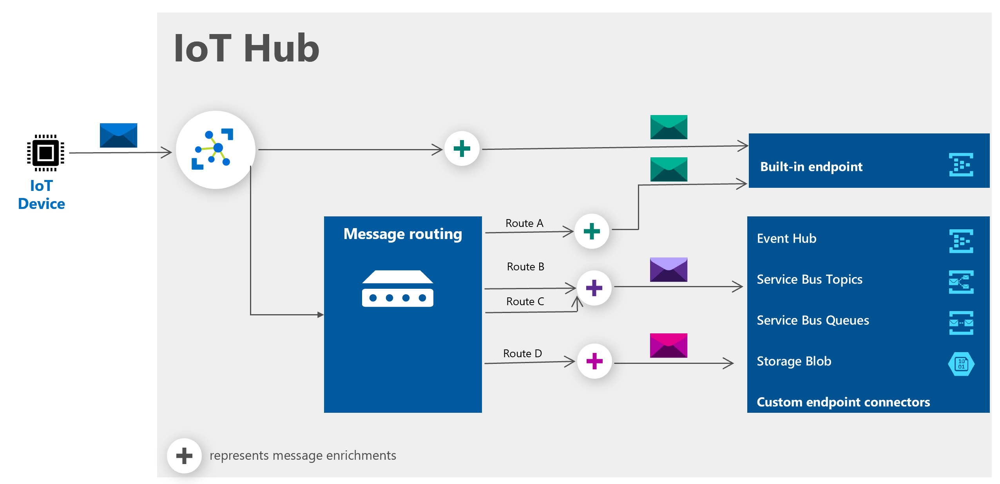
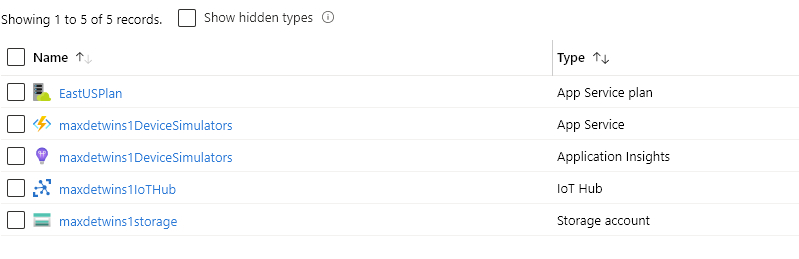
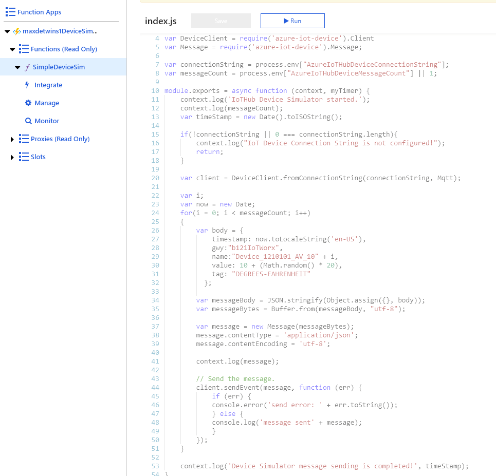
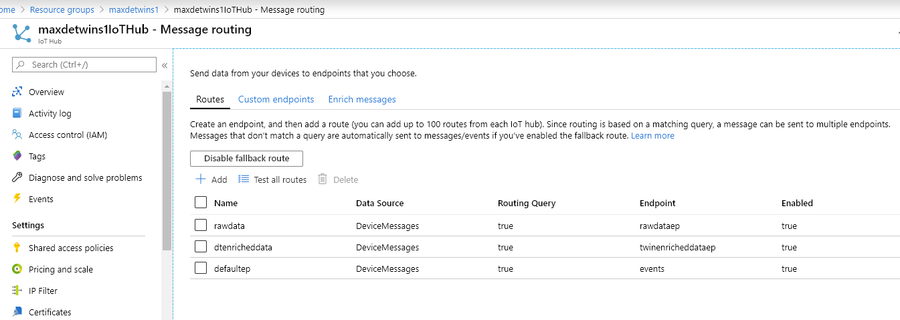
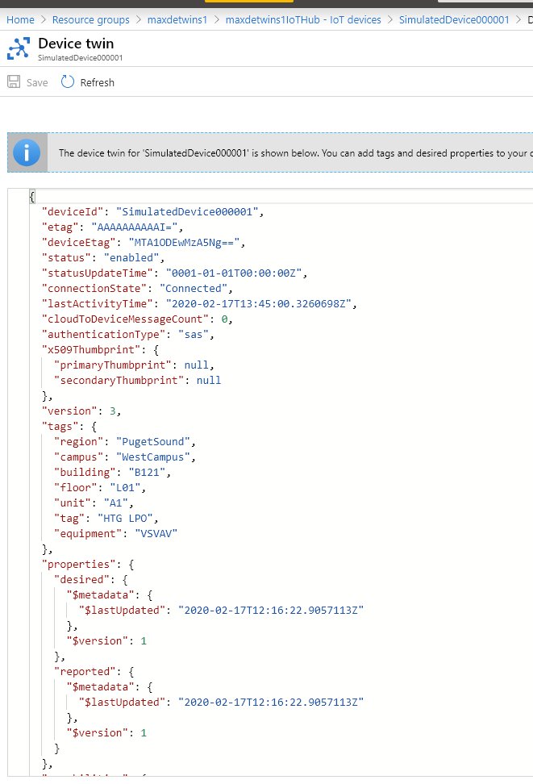
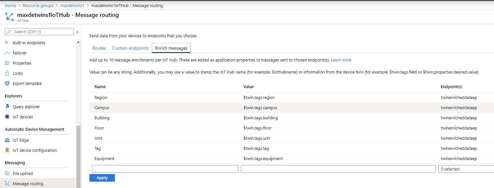
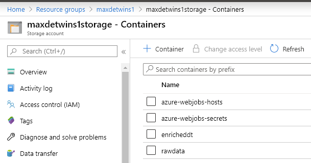
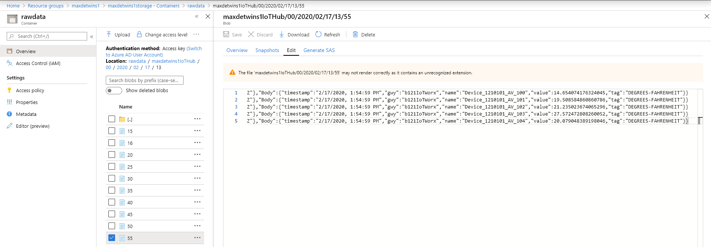
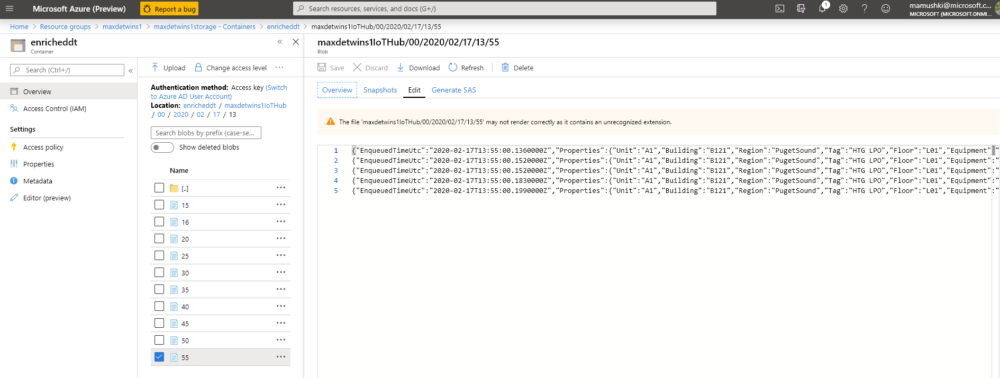

# Tutorial: Use Azure IoT Hub message enrichments

*Message enrichments* describes the ability of Azure IoT Hub to *stamp* messages with additional information before the messages are sent to the designated endpoint. One reason to use message enrichments is to include data that can be used to simplify downstream processing. For example, enriching device telemetry messages with a device twin tag can reduce load on customers to make device twin API calls for this information.



In this tutorial, we will create and configure the resources that are needed to test the message enrichments for an IoT hub. The resources include one storage account with two storage containers. One container holds the enriched messages, and another container holds the original messages. Also included is an IoT hub to receive the messages and route them to the appropriate storage container based on whether they're enriched or not. Also we will deploy Divice simulator and configure it to send telemetry data to initially created IoTHub.

* We will use the Azure CLI to create the resources and configure the message routing and define enrichment rules.

## Prerequisites

* You must have an Azure subscription. If you don't have an Azure subscription, create a [free account](https://azure.microsoft.com/free/?WT.mc_id=A261C142F) before you begin.
* Install [Visual Studio Code](https://code.visualstudio.com/).

## Resources creation and configuration script
Open dataenrichmentdevicetwins.azcli in VS Code or Azure [Cloud Shell window](https://shell.azure.com) and ensure that it's set to Bash.
Specify your own Azure Subscription name and preferred Resource Group name bellow.

```azurecli-interactive
# Initialize these variables:
$subscriptionId = [Your Azure Subscription name]
$resourceGroupName = [Your Azure Resource Group name]
$location = "eastus"
$iotHubName = $resourceGroupName + "IoTHub"
$rawdataep = "rawdataep"
$dtenricheddataep = "twinenricheddataep"
$consumerGroupNameDeviceTwin = "devicetwinenrichment"
$deviceId = "SimulatedDevice000001"
$storageAccountName = $resourceGroupName+"storage"
$storageRawDataContainer = "rawdata"
$storageEnrichedDTContainer = "enricheddt"
$deviceSimFunctionAppName = $resourceGroupName+"DeviceSimulators"
$deviceSimFunctionAppGitRepo = "https://github.com/maxmushkin/IoTHubDeviceSimulator.git"


# Login and set the specified subscription
az login
az account set -s $subscriptionId

# Create the resource group in the specified location
az group create --name $resourceGroupName --location $location

# Create an IoT Hub, create a consumer group, add a device, and get the device connection string
az iot hub create -n $iotHubName -g $resourceGroupName --location $location --sku S1
az iot hub consumer-group create -n $consumerGroupNameDeviceTwin --hub-name $iotHubName -g $resourceGroupName

# Create IoT Hub Device
az iot hub device-identity create -d $deviceId --hub-name $iotHubName -g $resourceGroupName

# Saving recently created device connection string to the variable
$deviceConnectionString=$(az iot hub device-identity show-connection-string -n $iotHubName -d $deviceId --query connectionString -o tsv)

# Create Storage Account
az storage account create -n $storageAccountName -g $resourceGroupName -l $location --sku Standard_LRS

# Saving Storage account connection string to the variable
$storageConnectionString = $(az storage account show-connection-string -g $resourceGroupName -n $storageAccountName --subscription $subscriptionId --query connectionString -o tsv)

# Saving Storage account Key string to the variable
$storageAccountKey = $(az storage account keys list -g $resourceGroupName -n $storageAccountName --query '[0].value' -o json)

# Deploy a Device Simulator function app with source files deployed from the specified GitHub repo.
az functionapp create --name $deviceSimFunctionAppName --storage-account $storageAccountName --consumption-plan-location $location --resource-group $resourceGroupName --deployment-source-url $deviceSimFunctionAppGitRepo --deployment-source-branch master

# Configure Device Simulator Application Settings
az functionapp config appsettings set --name $deviceSimFunctionAppName --resource-group $resourceGroupName --settings "AzureIoTHubDeviceConnectionString=$deviceConnectionString"
az functionapp config appsettings set --name $deviceSimFunctionAppName --resource-group $resourceGroupName --settings "AzureIoTHubDeviceMessageCount=5"

# Create IoTHub RAW data routing endpoint and route
az storage container create --account-name $storageAccountName -n $storageRawDataContainer
az iot hub routing-endpoint create --resource-group $resourceGroupName --hub-name $iotHubName --endpoint-name $rawdataep --endpoint-type azurestoragecontainer --endpoint-resource-group $resourceGroupName --container-name $storageRawDataContainer --connection-string $storageConnectionString --endpoint-subscription-id $subscriptionId --encoding json -b 60 --chunk-size 10
az iot hub route create -g $resourceGroupName --hub-name $iotHubName --endpoint-name $rawdataep --source-type devicemessages  --route-name rawdata

# Create IoTHub Device Twin Enriched data endpoint
az storage container create --account-name $storageAccountName -n $storageEnrichedDTContainer
az iot hub routing-endpoint create -g $resourceGroupName --hub-name $iotHubName -n $dtenricheddataep -t azurestoragecontainer -r $resourceGroupName --container $storageEnrichedDTContainer --encoding json -c $storageConnectionString -s $subscriptionId -b 60 --chunk-size 10
az iot hub message-enrichment create --name $iotHubName --key Region --value '$twin.tags.region' --endpoints $dtenricheddataep
az iot hub message-enrichment create --name $iotHubName --key Campus --value '$twin.tags.campus' --endpoints $dtenricheddataep
az iot hub message-enrichment create --name $iotHubName --key Building --value '$twin.tags.building' --endpoints $dtenricheddataep
az iot hub message-enrichment create --name $iotHubName --key Floor --value '$twin.tags.floor' --endpoints $dtenricheddataep
az iot hub message-enrichment create --name $iotHubName --key Unit --value '$twin.tags.unit' --endpoints $dtenricheddataep
az iot hub message-enrichment create --name $iotHubName --key Tag --value '$twin.tags.tag' --endpoints $dtenricheddataep
az iot hub message-enrichment create --name $iotHubName --key Equipment --value '$twin.tags.equipment' --endpoints $dtenricheddataep

# Create IoT Hub enriched data endpoint and route
az iot hub route create -g $resourceGroupName --hub-name $iotHubName --endpoint-name $dtenricheddataep --source-type devicemessages  --route-name dtenricheddata

# Create route for built in endpoint
az iot hub route create -g $resourceGroupName --hub-name $iotHubName --endpoint-name events --source-type devicemessages  --route-name defaultep
az iot hub device-twin update --device-id $deviceId --hub-name $iotHubName --set tags="{'region':'PugetSound', 'campus': 'WestCampus', 'building': 'B121', 'floor': 'L01', 'unit': 'A1', 'tag': 'HTG LPO', 'equipment': 'VSVAV'}"

# Use this command to delete resource group when no longer needed
# az group delete -n $resourceGroupName
```

At this point, the resources are all set up and the message routing is configured. You can view the message routing configuration and message enrichments in the portal.

## Azure resources review



Here we can see that we've got an IoT Hub, Device Simulator function app and Storage.

[Device Simulator](https://github.com/maxmushkin/IoTHubDeviceSimulator/) has been deployed and configured and we can view and modify it right from the Azure Portal if needed. Follow the link to know more about device Simulator.


We can review IoT Hub routes and endpoints


Review Device Twin properties:


Review IoT Hub Data Enrichment:


A message enrichment has three key elements:

* Enrichment name or key

* A value

* One or more endpoints for which the enrichment should be applied.

The **key** is a string. A key can only contain alphanumeric characters or these special characters: hyphen (`-`), underscore (`_`), and period (`.`).

The **value** can be any of the following examples:

* Any static string. Dynamic values such as conditions, logic, operations, and functions are not allowed. For example, if you develop a SaaS application that is used by several customers, you can assign an identifier to each customer and make that identifier available in the application. When the application runs, IoT Hub will stamp the device telemetry messages with the customer's identifier, making it possible to process the messages differently for each customer.

* The name of the IoT hub sending the message. This value is *$iothubname*.

* Information from the device twin, such as its path. Examples would be *$twin.tags.field* and *$twin.tags.latitude*.

Lastly let's check what we've got in Azure storage:


In addition to service containers, we can see rawdata and enricheddt containers storing raw and enriched data respectively.

We can preview raw data from the portal:


Raw json message:

```json
{ 
   "EnqueuedTimeUtc":"2020-02-17T13:55:00.1990000Z",
   "Properties":{ 

   },
   "SystemProperties":{ 
      "connectionDeviceId":"SimulatedDevice000001",
      "connectionAuthMethod":"{\"scope\":\"device\",\"type\":\"sas\",\"issuer\":\"iothub\",\"acceptingIpFilterRule\":null}",
      "connectionDeviceGenerationId":"637175385829057113",
      "contentType":"application/json",
      "contentEncoding":"utf-8",
      "enqueuedTime":"2020-02-17T13:55:00.1990000Z"
   },
   "Body":{ 
      "timestamp":"2/17/2020, 1:54:59 PM",
      "gwy":"b121IoTWorx",
      "name":"Device_1210101_AV_104",
      "value":20.079048389198046,
      "tag":"DEGREES-FAHRENHEIT"
   }
}
```

We can preview raw data from the portal:


Enriched json message:

```json
{ 
   "EnqueuedTimeUtc":"2020-02-17T13:55:00.1990000Z",
   "Properties":{ 
      "Unit":"A1",
      "Building":"B121",
      "Region":"PugetSound",
      "Tag":"HTG LPO",
      "Floor":"L01",
      "Equipment":"VSVAV",
      "Campus":"WestCampus"
   },
   "SystemProperties":{ 
      "connectionDeviceId":"SimulatedDevice000001",
      "connectionAuthMethod":"{\"scope\":\"device\",\"type\":\"sas\",\"issuer\":\"iothub\",\"acceptingIpFilterRule\":null}",
      "connectionDeviceGenerationId":"637175385829057113",
      "contentType":"application/json",
      "contentEncoding":"utf-8",
      "enqueuedTime":"2020-02-17T13:55:00.1990000Z"
   },
   "Body":{ 
      "timestamp":"2/17/2020, 1:54:59 PM",
      "gwy":"b121IoTWorx",
      "name":"Device_1210101_AV_104",
      "value":20.079048389198046,
      "tag":"DEGREES-FAHRENHEIT"
   }
}
```

[!NOTE]

   > * At this time, only $iothubname, $twin.tags, $twin.properties.desired, and $twin.properties.reported are supported variables for message enrichment.
   > * Message Enrichments are added as application properties to messages sent to chosen endpoint(s).
